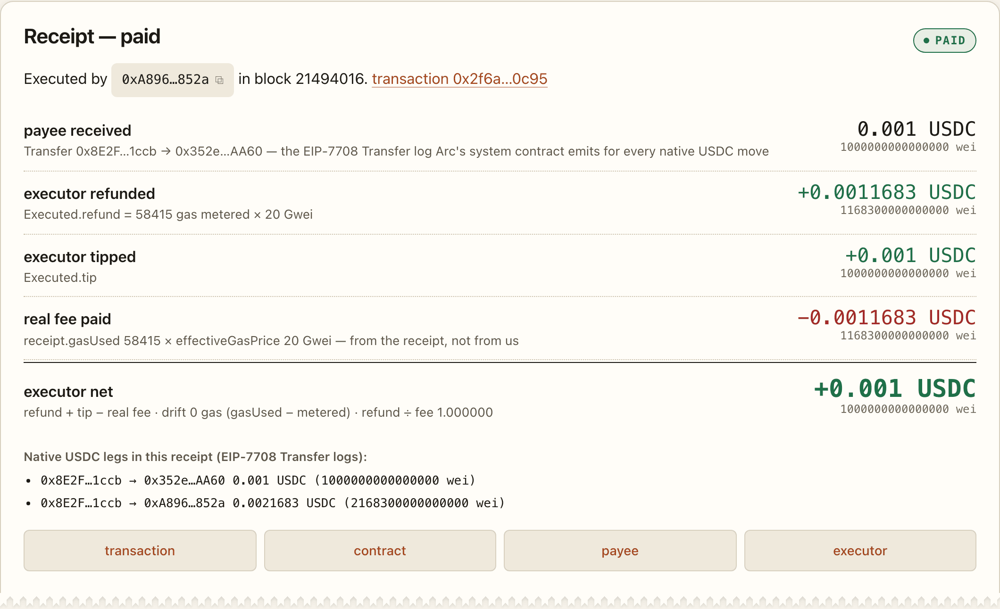
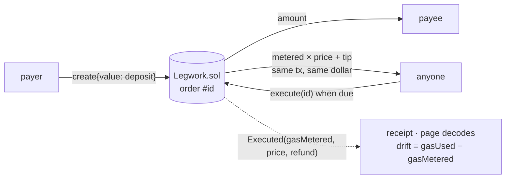

<div align="center">
  
  <h1>Legwork 🧾</h1>
  <p><em>Standing USDC orders anyone can run — and be repaid the exact gas, in the same dollar, in the same transaction.</em></p>
  

  A payer funds a recurring payment with native USDC on Arc. When it is due, <b>anyone</b> calls <code>execute</code>. Inside that call the contract pays the payee, meters the gas the call consumed, and pays the executor that gas plus the payer's tip out of the same deposit. No price oracle, no keeper network, no upkeep token, no server — because on Arc the gas and the payment are the same dollar, so the refund is arithmetic. <b>30 of 30 mainnet runs: drift 0 gas, refund ÷ real fee 1.000000</b> — reproduce with <code>npm run recheck</code>.

  <br/>

  [](https://legwork.edycu.dev/)
  [](https://legwork.edycu.dev/#/judge)
  [](https://youtu.be/YPUbDlJc1lY)
  [](https://explorer.arc.io/address/0x8E2F8AFC29e9dc127103CD6AD5BCfBe661141ccb)
  [](https://dorahacks.io/hackathon/arc-microgrants/detail)
  [](https://dorahacks.io/buidl/49025)

  <br/>

  
  
  
  
  
  
  
  
  
  
  [](LICENSE)
  [](https://github.com/edycutjong/legwork/actions/workflows/ci.yml)
  [](https://github.com/edycutjong/legwork/releases/latest)

</div>

---

## 📸 See it in Action

<div align="center"></div>

That is order #5 on Arc mainnet, created from the page's form and run from its **Execute** button
([`0x2f6a352d…0c95`](https://explorer.arc.io/tx/0x2f6a352d11823a37ad085151067856131833ef978445fbed5941e7d17b5b0c95)) — the page renders it at
[`#/o/5/tx/0x2f6a…`](https://legwork.edycu.dev/#/o/5/tx/0x2f6a352d11823a37ad085151067856131833ef978445fbed5941e7d17b5b0c95) from the chain,
although the order itself has since been cancelled. It is the second of the two
page-driven orders; the first, #4 ([`0xf71fffd0…7154`](https://explorer.arc.io/tx/0xf71fffd0f3dee7e43f9df1ba87bc7f954e97d29d42a59435ead45485b5dd7154)), read the same to the wei.
Two of the five lines come from the contract's own event; one comes from the transaction receipt and nowhere else.
They agree to the wei. `gasUsed` 58,415 on the receipt; `gasMetered` 58,415 in the event; drift 0.

> **Create order → anyone executes → exact refund receipt.** One flow, one transaction per run, every number read from the chain in the browser.

---

## 💡 The Problem & Solution

### The Problem
A recurring USDC payment on an EVM chain needs *someone* to send the transaction when it is due. Today that someone is a cron
box holding a hot key and a balance of a second token for gas — or a keeper network with its own token, its own operators and a
price oracle to work out what the gas was worth in the currency being paid. The Monday the box runs out of gas, nobody gets paid
and nobody gets told.

### The Solution
**Legwork** makes the order itself pay whoever runs it. A payer funds a standing order with native USDC; when it is due,
**anyone** calls `execute`. Inside that one call the contract pays the payee, meters the gas the call consumed, prices it at
`min(tx.gasprice, 2 × basefee, order.maxGasPrice)`, and pays the executor that amount plus the payer's tip — from the same
deposit, in the same transaction. On Arc the gas and the payment are the same 18-decimal dollar, so `metered × price` *is* the
refund: no oracle, no keeper network, no ERC-20 approvals, no server.

**Who this is for:** anyone who pays the same address on a schedule in USDC — retainers, payroll, subscriptions, any payee that
accepts native USDC within the 30,000-gas stipend — and does not want to run a cron box holding a hot key and a second gas token to do it; and payees, who can be their own
executor and collect on the tick (five of the thirty bench rows are exactly that).

**Key properties**
- ⚡ **Anyone executes, repaid in-tx** — the executor's net is exactly the tip; measured on 30/30 mainnet runs.
- 🧮 **No oracle** — gas and payment are one native asset; the refund is `gasMetered × price`, checked against the receipt on every run.
- 🛑 **Never a partial payment** — `Underfunded` reverts whole; a refusing payee pauses the order and the executor is still repaid.

---

## 🏗️ Architecture & Tech Stack

| Layer | Technology |
|---|---|
| **Contract** | Solidity 0.8.30 (osaka), one 212-line contract, transient storage guard + once-per-tx intrinsic flag; Foundry (unit · fuzz · invariants) |
| **Chain** | Arc mainnet (5042) — native USDC gas, EIP-1559 with a 20 Gwei floor, EIP-7708 system-emitter `Transfer` logs, finality at inclusion |
| **Page** | Vite + TypeScript + viem, no framework, no backend; hash-routed (`#/`, `#/o/1`, `#/o/5/tx/0x2f6a352d…0c95`, `#/judge`); reads are anonymous JSON-RPC, writes go through `window.ethereum` only |
| **Reads** | `orders(id)` · `OVERHEAD()` · `nextId` · Multicall3 for the list · `baseFeePerGas` of the latest block · `eth_gasPrice` · `eth_getLogs` (two-ended, ≤ 9,000-block windows) · `eth_getTransactionReceipt` |
| **Scripts** | `orders.ts` (seed), `meter-bench.ts` (bench), `recheck-receipts.ts` (verdict), `preflight.py` (readiness + bytecode identity) — tsx + viem, keys in a Foundry keystore decrypted in a child `cast` process |

### How one execute works

```
1  g0 = gasleft()                                    first statement
2  transient re-entrancy guard
3  load order; NoOrder / IsPaused / NotDue checks
   first execute of this transaction? credit the 21,000 intrinsic to it (transient flag) — batched executors get it once
4  price = min(tx.gasprice, 2 × block.basefee, order.maxGasPrice)
5  need  = amount + tip + 120,000 × price; revert Underfunded if the deposit is short   (never a partial payment)
6  nextDue += interval; deposit -= amount + tip                     effects before interaction
7  payee.call{value: amount, gas: 30,000}
8  if it failed: paused = true; deposit += amount; emit Paused      (metered — it is before the measurement point)
9  metered = g0 − gasleft() + OVERHEAD, clamped at 120,000          measurement point: nothing variable runs after this
10 refund  = metered × price, bounded by the deposit
11 deposit -= refund
12 executor.call{value: refund + tip, gas: 30,000}                  one leg, one EIP-7708 Transfer log
13 emit Executed(id, executor, metered, price, refund, tip, nextDue, paid)   fixed width on both branches
14 guard reset
```

`OVERHEAD` is the gas outside the measured window — intrinsic, calldata, the payout call, the event, the guard reset — and
it is a constant per call shape, so it is an immutable constructor argument measured against real receipts. The first deploy
with the pre-build estimate (31,400) was under by exactly 1,103 gas on three runs; the production deploy carries 32,503 and has
metered 35 of its 36 runs to the gas, the 36th (a refused payment) 6 gas over — on v1 and again on v2. Full line-by-line in [`ARCHITECTURE.md`](./ARCHITECTURE.md).



---

## 🏆 Arc Integration — where Arc is load-bearing

1. **The native asset is the stablecoin people schedule payments in** — "Arc's native token is USDC, not ETH … a native interface
   (18 decimals)" (`references/evm-differences`). The deposit, the payment, the refund and the tip are one asset, the one gas is
   paid in, so `metered × tx.gasprice` *is* the refund ([`Legwork.sol:142-167`](./contracts/Legwork.sol)). The arithmetic works
   for any chain's native asset; a *USDC* order on a chain where USDC is an ERC-20 needs a price oracle or a second funding
   token, which is why USDC schedules elsewhere get keeper networks. This is the one dependency; the rest make it legible and robust.
2. **The base fee is not burned** — "Both the base fee and the priority fee are credited to the block's beneficiary"
   (`concepts/stable-fee-design`). So the `2 × block.basefee` cap ([`Legwork.sol:143`](./contracts/Legwork.sol)) is a necessity, not
   a nicety: whoever produces a block and also executes orders in it would otherwise be paid the surplus twice. It is a bound, not a
   claim about who produces Arc's blocks; `maxGasPrice` is the payer's tighter one.
3. **Finality at inclusion** — "Transactions finalize on inclusion; offchain systems can act after a single confirmation"
   (`references/evm-differences`). The receipt renders on the first poll ([`src/app/rpc.ts`](./src/app/rpc.ts)); the bench loop
   ran 30 consecutive 1-second periods with no confirmation depth.
4. **Native transfers can revert for protocol reasons** — "A native transfer can revert even when the sender has sufficient
   balance" (`references/evm-differences`). The pause path ([`Legwork.sol:156-161`](./contracts/Legwork.sol)) exists because Arc
   says a payee can start refusing money; nothing bricks and nothing bleeds.
5. **Both money legs are `Transfer` logs** — EIP-7708 from the system emitter (`references/usdc-system-events`). The payee's
   amount and the executor's refund + tip are visible as token transfers in the receipt and on the explorer; the page decodes them
   ([`src/lib/receipt.ts`](./src/lib/receipt.ts)) and `recheck` asserts the executor leg equals `refund + tip` on every row.

The contract's `tx.gasprice` equalled the receipt's `effectiveGasPrice` on every run — standard EIP-1559 semantics that Arc
shares, not an Arc feature; the recheck's price equality is the guard that would catch a client change.

---

## ⛓️ Live Deployment

**No wallet needed anywhere to read** — every page is an anonymous JSON-RPC call; a wallet is touched only when you press *Create*, *Execute* or a payer button.

| | |
|---|---|
| Live page | [legwork.edycu.dev](https://legwork.edycu.dev/) · reviewer page [`#/judge`](https://legwork.edycu.dev/#/judge) · seeded order [`#/o/1`](https://legwork.edycu.dev/#/o/1) |
| Demo video | [2:17 on YouTube](https://youtu.be/YPUbDlJc1lY) — a real create → execute on mainnet (order #10, receipt [`0x2b33e38f…d255`](https://explorer.arc.io/tx/0x2b33e38f8404b12be1c07706c196991a05da1824ab08ea1b95f833c6cd6ad255)), recorded from the live page; captions included |
| Contract | [`0x8E2F8AFC29e9dc127103CD6AD5BCfBe661141ccb`](https://explorer.arc.io/address/0x8E2F8AFC29e9dc127103CD6AD5BCfBe661141ccb) on Arc mainnet (5042) · `OVERHEAD = 32503` gas, calibrated on-chain (three runs, drift 1,103 on all three, spread 0); v2 of the contract — v1 and the calibration deploy are kept in the record (Corrections below) · on-chain runtime bytecode == `forge build` with the immutable filled (`scripts/preflight.py --bytecode`) |
| Open orders | #1 `live` (0.02 USDC / 60 s / tip 0.01 — **two runs left for reviewers, first come**; due since 2026-09-18, the missed periods are owed, so one wallet can take both back-to-back) · #2 `rejecting` (paused: its payee is the [`Rejector`](./contracts/Rejector.sol) `0x1c17C16177f2aC609440ea20c00D0e108F617c47`) · #3 `capped` (`maxGasPrice` 20 Gwei) |
| Key receipts | hero [`0x2f6a352d…0c95`](https://explorer.arc.io/tx/0x2f6a352d11823a37ad085151067856131833ef978445fbed5941e7d17b5b0c95) · first live run [`0x0a598c84…d04d`](https://explorer.arc.io/tx/0x0a598c846c6a6fd0e9f07fcee1f6d643d39bb2c2483ae0e3465ee3c6775cd04d) · paused [`0xd07f9fb9…dc64`](https://explorer.arc.io/tx/0xd07f9fb9f06deeab35a0e795ab0440f8150fb60e4f816993d57bee6a1470dc64) · capped [`0x6595b5a6…3c98`](https://explorer.arc.io/tx/0x6595b5a60548ab65b879f9012142764f3118d582fdc29d5dc8da2b457d413c98) · `NotDue` [`0x4fc9a3af…56a6`](https://explorer.arc.io/tx/0x4fc9a3af02079e9bad40001108936c268a8269c88c231e6633517db854f556a6) |
| Proof | [`DEMO.md`](./DEMO.md): one mainnet transaction per edge case, the bench table, the calibration table, reproduce commands; **107 receipts** under [`proof/receipts/`](./proof/receipts/); [`deploy/arc-mainnet.json`](./deploy/arc-mainnet.json) holds every address, hash and block |
| Spend | 0.1944 USDC of gas over the 107 mainnet transactions |

---

## 📊 Engineering Rigor

| | |
|---|---|
| Bench | **30 real executes**, one order, 1-second periods: `gasUsed` p50 **58,415** · p95 **58,415** · **drift 0 on every row** (gate ≤ 50) · **refund ÷ real fee = 1.000000** on every row (pre-stated: 1.00 ± 0.02) · executor net after tip = exactly the tip · 25 rows by the payer wallet, 5 by **the payee collecting its own payment** |
| Cost of a run | 58,415 gas ≈ **0.00117 USDC** at Arc's 20 Gwei base fee; a refused payment costs 60,565; a `NotDue` revert 24,323 |
| Tests | **83 tests** — **47 Foundry** cases (38 unit · 3 fuzz suites × 512 runs · 6 invariants × 64 runs × depth 32) · **36 vitest** cases incl. **4 fast-check properties × 5,000 = 20,000 generated cases** on the refund arithmetic and the log reducer; the receipt decoder's fixtures are committed mainnet receipts · Playwright end-to-end on desktop + mobile incl. live mainnet reads |
| Solidity coverage | `forge coverage` on `contracts/Legwork.sol`: **100 % lines · 100 % functions · 98.7 % statements · 93.5 % branches**, gated in CI at 100 % lines. The two unreached anchors are documented, not missing: `if (refund > deposit)` (line 165) is a guard the pre-check makes unreachable — `testFuzz_refundNeverExceedsTheDepositSoTheGuardIsNeverTaken` drives the worst case and shows it never binds — and the `msg.value > uint128.max` revert (line 75) *is* executed by `test_create_rejectsADepositAboveUint128`, but solc merges its `revert BadParams()` with the identical one on the line above (5 in source, 4 in bytecode), so its anchor is dead code. `Rejector.sol` is excluded for the same reason: its one statement is a bare `revert()` merged with the dispatcher's. The contract is frozen on mainnet, so the source is not reshaped for the tool. |
| Recheck | `npm run recheck` recomputes all 75 committed execute receipts (36 on v2, 36 on the retired v1, 3 calibration) from raw data (six equalities per row, incl. `price == min(effectiveGasPrice, 2·basefee, maxGasPrice)`) — `all checks passed` |
| Readiness | `python3 scripts/preflight.py --bytecode` fails on a README count that stops matching the runners, a placeholder, private material, a DEMO hash without a receipt, or on-chain code that is not this source |

### Attacks defeated

| Situation | Behaviour | Proof |
|---|---|---|
| The payee is a contract that refuses native USDC | the order **pauses**; the unpaid amount stays in the deposit; the executor who found out is still refunded and tipped; the payer resumes or cancels | [`0xd07f9fb9…dc64`](https://explorer.arc.io/tx/0xd07f9fb9f06deeab35a0e795ab0440f8150fb60e4f816993d57bee6a1470dc64) (`Paused` + `Executed(paid = false)`, one Transfer leg) · `test_execute_rejectingPayeePausesRepaysExecutorKeepsAmount` |
| An executor prices above the order's `maxGasPrice` | refund capped at `maxGasPrice`; the executor eats the difference | [`0x6595b5a6…3c98`](https://explorer.arc.io/tx/0x6595b5a60548ab65b879f9012142764f3118d582fdc29d5dc8da2b457d413c98) (20 Gwei refund against a 30 Gwei fee, ratio 0.667) · `test_execute_priceCappedAtMaxGasPrice` |
| Executed before it is due | reverts `NotDue(nextDue)`; nothing moves; a simulating executor sees it for free (simulation does not help in a same-block race — the loser pays the same 24k) | [`0x4fc9a3af…56a6`](https://explorer.arc.io/tx/0x4fc9a3af02079e9bad40001108936c268a8269c88c231e6633517db854f556a6) (status 0, 24,323 gas — the cost of not simulating) · `test_execute_revertsNotDue` |
| The deposit cannot cover `amount + tip + reserve` | reverts `Underfunded(have, need)` — **never a partial payment**; the page says "top up ≥ X" | `test_execute_revertsUnderfundedNeverPartial`, `invariant_I4_noPartialPayment`; the `live` order reaches this after its third run |
| An executor prices above `2 × basefee` | refund capped there regardless of `maxGasPrice` — the surplus would otherwise go to a block producer who could also be the executor | `test_execute_priceCappedAtTwiceBasefee`, `testFuzz_priceCapHoldsOverFullRange` (full `uint48` range), `invariant_I3_priceCap` |
| Periods were missed | they are owed and caught up one per execute; the page says "N periods are owed" | `test_execute_missedPeriodsAreCaughtUpOnePerExecute`, `invariant_I6_onePeriodPerExecute` |
| A contract executor batches several orders in one transaction | the 21,000 intrinsic is credited once per transaction, not per order | `test_execute_batchedExecutorIsChargedTheIntrinsicOnce` — the v1 → v2 fix |
| An executor starves a working contract payee of gas | cannot pause it: the outer call fails too (63/64 rule) | `test_execute_gasStarvationCannotPauseAWorkingPayee` (200 gas limits swept) |
| A payee, executor or payer re-enters | the transient guard reverts the inner call; cancel is CEI-ordered | `test_execute_reenteringPayeeIsBlocked`, `test_execute_contractExecutorCannotReenterCancel`, `test_reentrancy_topUpAndResumeFromInsideExecuteAreBlocked`, `test_cancel_reenteringPayerCannotBreakConservation` |
| Deposits leak or are double-spent | impossible by invariant: Σ open deposits == contract balance under any interleaving | `invariant_I1_depositConservation` (64 runs × depth 32) |
| The payee is runtime-blocklisted | the same pause path — Arc lets a native transfer revert "even when the sender has sufficient balance" | tested by construction; we hold no address the protocol refuses to pay |

### Honest limits (9)

1. The metering constant is per call shape and per client version; an opcode repricing would need a redeploy (constructor argument).
2. The drift bound holds for executors that are plain accounts. A contract executor's own code — its call into `execute`, its
   `receive` — runs outside the window and pays for itself; the one thing it shares with the transaction, the 21,000 intrinsic,
   is credited once per transaction (since v2).
3. The "real fee" on the page is derived from the receipt because Arc does not log gas deductions — which is exactly why it is
   printed *beside* the contract's number rather than asserted by it.
4. A contract payee must accept native USDC within a 30,000-gas stipend; one that needs more is paused on every run. A payer that
   is a contract refusing USDC back can never cancel. Both are the caller's own construction.
5. Executors are "anyone" in principle and two wallets in practice: the page button and the bench script, plus the demo payee
   collecting its own payment. Nobody else runs orders yet.
6. All bench rows sit at a 20 Gwei base fee — the only base fee Arc showed that day — so the `2 × basefee` cap is exercised by
   tests and the `capped` receipt, not by the bench.
7. The page has exactly one external dependency, the public Arc RPC (anonymous, CORS-enabled today; documented as "permissioned") —
   no fonts, no analytics, no CDN; the contract has none. The RPC occasionally answers HTTP 429 to the history scan; requests are
   paced 400 ms apart and viem retries the rest. Explorer source verification was not attempted (its API is behind a challenge page); the runtime-bytecode
   identity check in `scripts/preflight.py --bytecode` is the substitute.
8. The contract's `status` / `needed` / `priceCap` views read `block.basefee`. An `eth_call` sent without a gas price is simulated at
   base fee 0 on Arc's RPC (geth behaviour), so from `cast call` they report a reserve of 0 and a cap of 0 unless `--gas-price` is
   given; `execute` itself always sees the real base fee. The page does not use those views — it computes the same arithmetic from
   the block's `baseFeePerGas` (`src/lib/orders.ts`), which is what the tests cover.
9. Left out on purpose: a paymaster (the order already repays the executor — sponsoring its gas would pay twice), batched
   execution (one order per transaction is what keeps the metering exact), and a server of any kind.

### Corrections

- 2026-09-18 — **v1 → v2.** The second audit round found that the intrinsic 21,000 was credited on every `execute` call, so a contract
  executor batching K orders in one transaction was over-refunded 21,000 × (K − 1) gas — bounded by each order's reserve, never
  exploited, but not "exact". v2 credits it once per transaction (transient flag). v1
  [`0x68a92aF2Be2e6A640a19508a0fe44cbc8B2C62E2`](https://explorer.arc.io/address/0x68a92aF2Be2e6A640a19508a0fe44cbc8B2C62E2) had its demo orders cancelled and holds 0; its 36 execute receipts (same drift picture: 0 / −6) stay in `proof/receipts/` and are rechecked. Same `OVERHEAD`: the change is inside the measured window.
- 2026-09-18 — `OVERHEAD` estimate 31,400 → measured **32,503** (three calibration runs, drift 1,103, spread 0). The wrong number
  stays visible in `deploy/arc-mainnet.json` and in the three calibration receipts.
- 2026-09-18 — the paused branch meters 6 gas *over* (`gasUsed` 60,180 vs `gasMetered` 60,186): the executor is over-refunded by
  120 Gwei ≈ $0.0000001 on a refused payment. Inside the gate; left as is.
- 2026-09-18 — a bench run intended as a `NotDue` demonstration landed as a normal 31st execute on v1 (a second had passed on a
  1-second order). The revert was reproduced on a 1-hour order instead, on v1 and on v2; the extra receipt is kept and rechecked, not counted.
- 2026-09-19 — the page's history scan read the newest 8 × 9,000 blocks only (≈ 10 h at Arc's ≈ 2 blocks/s), so a seeded order's
  day-one runs vanished from *Recent runs* by the next day. Found by the post-build review; the scan now reads from both ends of the
  order's life (`src/lib/scan.ts`).

---

## 🚀 Getting Started

### For reviewers — the 60-second path, no clone
**Run the seeded order** (any wallet holding a few cents of USDC on Arc): open
[`legwork.edycu.dev/#/o/1`](https://legwork.edycu.dev/#/o/1), press **Execute — anyone can**,
read the receipt. The payee gets 0.02 USDC; you get the metered gas back plus a 0.01 USDC tip. Two runs were left at the time of writing, first come — and since the order has been due since
2026-09-18, the missed periods are owed, so one reviewer can take both back-to-back (the card says how many are left right now). No wallet? Open the
[committed hero receipt](https://legwork.edycu.dev/#/o/5/tx/0x2f6a352d11823a37ad085151067856131833ef978445fbed5941e7d17b5b0c95) — read from the chain, no signing.

**Build your own in 60:** *New order* → payee, amount, interval, tip → **Create** (the deposit for one run is quoted from the latest
base fee) → the card opens *Due* → **Execute**. Reading the page needs no wallet at all; signing uses the injected one and
offers to add Arc (chain 5042) if it is missing. Prerequisite: USDC on Arc — bringing it from another chain is Circle's bridge, not this project.

### Prerequisites
- Node.js ≥ 22 · [Foundry](https://getfoundry.sh) · Python 3 (readiness gate only)

### Installation
```sh
git clone https://github.com/edycutjong/legwork && cd legwork && git submodule update --init   # forge-std
npm install
npm run dev                # the page, against Arc mainnet, read-only until you connect a wallet
```
Writing scripts (`npm run orders`, `npm run bench`) need a funded Foundry keystore — `cp .env.example .env` and read the comments; nothing else does.

---

## 🧪 Testing & CI

```sh
# ── Code quality ──────────────────────────────
npm run lint            # oxlint
npm run typecheck       # tsc --noEmit
npm test                # vitest: 32 unit cases + 4 fast-check properties (20,000 cases)
npm run test:coverage   # + v8 coverage
forge test              # 47 Foundry cases: unit · fuzz × 512 · invariants × 64 × 32
npm run ci              # audit + lint + typecheck + coverage

# ── Proof ─────────────────────────────────────
npm run recheck                          # recompute all 75 committed execute receipts; exit code is the verdict (≈ 40 s, read-only)
python3 scripts/preflight.py --bytecode  # readiness gate + on-chain runtime code == forge build

# ── Advanced ──────────────────────────────────
npm run e2e             # Playwright: smoke · reviewer route · live mainnet reads · responsive (chromium + Pixel 7)
npm run lighthouse      # Lighthouse CI on / and /#/judge
npm run security-scan   # npm audit + license check + gitleaks over the full history
npm run bench -- --n 5  # ≈ a cent of real gas: creates, runs 5×, cancels its own order (needs a keystore)
```

**6-stage pipeline** (`.github/workflows/ci.yml`): Quality (web on Node 22/24 + Foundry; `forge fmt --check` advisory) → Security (gitleaks over the full history blocks; npm audit and the license check are advisory) → Build + JS budget + readiness gate → E2E → Lighthouse (accessibility is the hard gate) → Deploy gate to `gh-pages`. CodeQL (TypeScript + Python), Dependabot (npm · actions · submodule, grouped, monthly, no majors) and semantic releases from conventional commits run beside it.

| Layer | Tool | Status |
|---|---|---|
| Contract | Foundry — 47 cases, 3 fuzz suites × 512, 6 invariants × 64 × depth 32 | ✅ |
| Unit + property | vitest 36 cases · fast-check 4 × 5,000 = 20,000 | ✅ |
| Proof | `npm run recheck` over 75 mainnet receipts · `preflight.py --bytecode` | ✅ |
| E2E | Playwright, 4 specs on chromium + Pixel 7, incl. live mainnet reads | ✅ |
| Lint / types | oxlint · tsc | ✅ |
| Security (SAST) | CodeQL | ✅ |
| Security (SCA) | Dependabot alerts + automated fixes · `npm audit --audit-level=high` (advisory in CI) | ✅ |
| Secret scanning | gitleaks, full history, in CI and before every push | ✅ |
| Performance | Lighthouse CI — accessibility ≥ 0.9 fails the pipeline; performance / best-practices / SEO warn | ✅ |

---

## 📁 Project Structure

```
contracts/Legwork.sol         the contract (212 lines) · contracts/Rejector.sol  the refusing demo payee
test/Legwork.t.sol            38 unit + 3 fuzz · test/Legwork.invariants.t.sol  6 invariants with a handler
test/ts/                      32 vitest cases over the committed receipts + properties.test.ts (fast-check)
e2e/                          Playwright: smoke · judge · live · responsive
src/lib/                      order arithmetic · receipt decoding · two-ended bounded scan (pure, tested)
src/app/                      the page: rpc reads · wallet writes · three views (home · order · judge)
scripts/orders.ts             seed + first runs (+ --not-due) · scripts/meter-bench.ts  the bench · scripts/recheck-receipts.ts  the verdict
scripts/preflight.py          readiness gate (+ --bytecode identity)
deploy/arc-mainnet.json       every address, hash, block, the calibration record and the retired v1
proof/receipts/               107 mainnet receipts · proof/rows.csv · proof/results.json
docs/assets/                  icon, animated hero, social cards, the receipt capture
DEMO.md · ARCHITECTURE.md · JUDGE.md · docs/FRICTION-LOG.md
```

---

## 🗺️ Roadmap — a modifier, not a network

The reusable part is the metering block — record, meter, price, repay: `execute` lines 1, 4–5 and 9–12, about thirty lines with
the guard. As an abstract `Refunding` contract with a `repaysExecutor` modifier, any Arc contract could make a function
permissionlessly executable with the caller repaid from the contract's own USDC — payroll, DCA into vaults, subscription
pulls, agent jobs — with bots and agents earning tips instead of anyone operating a keeper. Pigeonhole, this builder's other
Arc entry (keyless deposit addresses), is a separate project that grew from the same observation about native USDC; the
modifier is where the two would meet.

- [x] Standing orders with exact gas reimbursement on Arc mainnet — 107 receipts
- [x] Two-ended history scan, reviewer route, property tests, CI harness
- [ ] Extract `Refunding` / `repaysExecutor` as an abstract contract with its own calibration script
- [ ] A third-party executor (bot or agent) running the seeded orders for the tip

---

## 📄 License

[MIT](LICENSE) © 2026 Edy Cu. Dates: one throwaway metering contract on mainnet on 2026-09-17 to check the idea; contract, tests, page, bench and docs on
2026-09-18; review, assets and harness on 2026-09-19. The deployer wallet is the same one behind this builder's separate Arc entry — distinct projects, said here so it is
not discovered.

## 🙏 Acknowledgments

Built for the [Arc Microgrants](https://dorahacks.io/hackathon/arc-microgrants/detail) program on DoraHacks. The Arc docs quoted above (`evm-differences`, `stable-fee-design`, `usdc-system-events`) are the ground truth every claim here cites; `docs/FRICTION-LOG.md` is what we found when they and the RPC disagreed.
