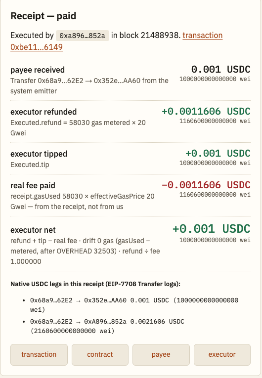

<div align="center">


# Legwork

### Standing USDC orders anyone can run — and be repaid the exact gas, in the same dollar, in the same transaction

A payer funds a recurring payment with native USDC on Arc. When it is due, **anyone** calls `execute`. Inside that call the
contract pays the payee, meters the gas the call consumed, and pays the executor that gas plus the payer's tip out of the same
deposit. No price oracle, no keeper network, no upkeep token, no server — because on Arc the gas and the payment are the same
dollar, so the refund is arithmetic.

[](https://edycutjong.github.io/legwork-arc/)
[](https://explorer.arc.io/address/0x68a92aF2Be2e6A640a19508a0fe44cbc8B2C62E2)
[](./DEMO.md)


</div>

---

## 1 · The receipt

<div align="center"></div>

That is order #4 on Arc mainnet, created from the page's form and run from its **Execute** button
([`0xbe115310…6149`](https://explorer.arc.io/tx/0xbe115310fd76f686c2bc8ee6a3d846f3c5a39561522898d166834d9047736149)).
Two of the five lines come from the contract's own event; one comes from the transaction receipt and nowhere else.
They agree to the wei. `gasUsed` 58,030 on the receipt; `gasMetered` 58,030 in the event; drift 0.

## 2 · Try it in 30 seconds · build your own in 60

**Run the seeded order** (any wallet holding a few cents of USDC on Arc): open
[`edycutjong.github.io/legwork-arc/#/o/1`](https://edycutjong.github.io/legwork-arc/#/o/1), press **Execute — anyone can**,
read the receipt. The payee gets 0.02 USDC; you get the metered gas back plus a 0.01 USDC tip. Two runs are left for reviewers.

**Build your own:** *New order* → payee, amount, interval, tip → **Create** (the deposit for one run is quoted from the latest
base fee) → the card opens *Due* → **Execute**. Reading the page needs no wallet at all; signing uses the injected one and
offers to add Arc (chain 5042) if it is missing. Prerequisite: USDC on Arc — bringing it from another chain is Circle's bridge, not this project.

## 3 · Numbers

| | |
|---|---|
| Contract | [`0x68a92aF2Be2e6A640a19508a0fe44cbc8B2C62E2`](https://explorer.arc.io/address/0x68a92aF2Be2e6A640a19508a0fe44cbc8B2C62E2) on Arc mainnet (5042) · `OVERHEAD = 32503` gas, calibrated on-chain (three runs, drift 1,103 on all three, spread 0) |
| Bench | **30 real executes**, one order, 1-second periods: `gasUsed` p50 **58,030** · p95 **58,030** · **drift 0 on every row** (gate ≤ 50) · **refund ÷ real fee = 1.000000** on every row (pre-stated: 1.00 ± 0.02) · executor net after tip = exactly the tip · 25 rows by the payer wallet, 5 by **the payee collecting its own payment** |
| Cost of a run | 58,030 gas ≈ **0.00116 USDC** at Arc's 20 Gwei base fee; a refused payment costs 60,180; a `NotDue` revert 24,323 |
| Tests | **36 Foundry** cases (28 unit · 2 fuzz suites × 512 runs · 6 invariants × 64 runs) · **32 vitest** cases, every fixture a committed mainnet receipt |
| Recheck | `npm run recheck` recomputes all 39 committed execute receipts from raw data (five equalities per row, incl. `price == min(effectiveGasPrice, 2·basefee, maxGasPrice)`) — `all checks passed` |
| Proof | [`DEMO.md`](./DEMO.md): one mainnet transaction per edge case, the bench table, the calibration table, reproduce commands; 55 receipts under [`proof/receipts/`](./proof/receipts/) |

```sh
forge test && npm test && npm run recheck && python3 scripts/preflight.py --bytecode
```

## 4 · How one execute works

```
1  g0 = gasleft()                                    first statement
2  transient re-entrancy guard
3  load order; NoOrder / IsPaused / NotDue checks
4  price = min(tx.gasprice, 2 × block.basefee, order.maxGasPrice)
5  need  = amount + tip + 120,000 × price; revert Underfunded if the deposit is short   (never a partial payment)
6  nextDue += interval; deposit -= amount + tip                     effects before interaction
7  payee.call{value: amount, gas: 30,000}
8  if it failed: paused = true; deposit += amount; emit Paused      (metered — it is before the measurement point)
9  metered = g0 − gasleft() + OVERHEAD, clamped at 120,000          measurement point: nothing variable runs after this
10 refund  = metered × price, bounded by the deposit
11 deposit -= refund
12 executor.call{value: refund + tip, gas: 30,000}                  one leg, one EIP-7708 Transfer log
13 emit Executed(id, executor, metered, price, refund, tip, nextDue, paid)   fixed width on both branches
14 guard reset
```

`OVERHEAD` is the gas outside the measured window — intrinsic, calldata, the payout call, the event, the guard reset — and
it is a constant per call shape, so it is an immutable constructor argument measured against real receipts. The first deploy
with the pre-build estimate (31,400) was under by exactly 1,103 gas on three runs; the production deploy carries 32,503 and has
metered 35 of its 36 runs to the gas, the 36th (a refused payment) 6 gas over. Full line-by-line in [`ARCHITECTURE.md`](./ARCHITECTURE.md).

## 5 · What breaks, and what happens then

| Situation | Behaviour | Proof |
|---|---|---|
| The payee is a contract that refuses native USDC | the order **pauses**; the unpaid amount stays in the deposit; the executor who found out is still refunded and tipped; the payer resumes or cancels | [`0xf4cdeb75…71b7`](https://explorer.arc.io/tx/0xf4cdeb7523c64082f9e09fa3bf738fd676bad1ef401c4f7c9622d0d41c3d71b7) (`Paused` + `Executed(paid = false)`, one Transfer leg) |
| An executor prices above the order's `maxGasPrice` | refund capped at `maxGasPrice`; the executor eats the difference | [`0x76d50864…3eaf`](https://explorer.arc.io/tx/0x76d508646679f86e55fbd50fe05b614a61cfa2cfa2721162abe7665f92343eaf) (20 Gwei refund against a 30 Gwei fee, ratio 0.667) |
| Executed before it is due | reverts `NotDue(nextDue)`; nothing moves; a simulating executor sees it for free | [`0x703f54c8…c9f6`](https://explorer.arc.io/tx/0x703f54c8d7b65de8d8031f60a5a917e52e77551acf1d2ba701c0e3c78264c9f6) (status 0, 24,323 gas — the cost of not simulating) |
| The deposit cannot cover `amount + tip + reserve` | reverts `Underfunded(have, need)` — **never a partial payment**; the page says "top up ≥ X" | Foundry; the `live` order reaches this after its third run |
| An executor prices above `2 × basefee` | refund capped there regardless of `maxGasPrice` — the surplus would otherwise go to a block producer who could also be the executor | Foundry (unit + fuzz over the full `uint48` range) |
| Periods were missed | they are owed and caught up one per execute; the page says "N periods are owed" | Foundry |
| A payee re-enters `execute` | the transient guard reverts the inner call | Foundry |
| The payee is runtime-blocklisted | the same pause path — Arc lets a native transfer revert "even when the sender has sufficient balance" | tested by construction; we hold no address the protocol refuses to pay |

## 6 · Where Arc is load-bearing

1. **The native asset is the stablecoin people schedule payments in** — "Arc's native token is USDC, not ETH … a native interface
   (18 decimals)" (`references/evm-differences`). The deposit, the payment, the refund and the tip are one asset, the one gas is
   paid in, so `metered × tx.gasprice` *is* the refund ([`Legwork.sol:132-157`](./contracts/Legwork.sol)). The arithmetic works
   for any chain's native asset; a *USDC* order on a chain where USDC is an ERC-20 needs a price oracle or a second funding
   token, which is why USDC schedules elsewhere get keeper networks. This is the one dependency; the rest make it legible and robust.
2. **The base fee is not burned** — "Both the base fee and the priority fee are credited to the block's beneficiary"
   (`concepts/stable-fee-design`). So the `2 × block.basefee` cap ([`Legwork.sol:133`](./contracts/Legwork.sol)) is a necessity, not
   a nicety: whoever produces a block and also executes orders in it would otherwise be paid the surplus twice. It is a bound, not a
   claim about who produces Arc's blocks; `maxGasPrice` is the payer's tighter one.
3. **Finality at inclusion** — "Transactions finalize on inclusion; offchain systems can act after a single confirmation"
   (`references/evm-differences`). The receipt renders on the first poll ([`src/app/rpc.ts`](./src/app/rpc.ts)); the bench loop
   ran 30 consecutive 1-second periods with no confirmation depth.
4. **Native transfers can revert for protocol reasons** — "A native transfer can revert even when the sender has sufficient
   balance" (`references/evm-differences`). The pause path ([`Legwork.sol:146-151`](./contracts/Legwork.sol)) exists because Arc
   says a payee can start refusing money; nothing bricks and nothing bleeds.
5. **Both money legs are `Transfer` logs** — EIP-7708 from the system emitter (`references/usdc-system-events`). The payee's
   amount and the executor's refund + tip are visible as token transfers in the receipt and on the explorer; the page decodes them
   ([`src/lib/receipt.ts`](./src/lib/receipt.ts)) and `recheck` asserts the executor leg equals `refund + tip` on every row.

The contract's `tx.gasprice` equalled the receipt's `effectiveGasPrice` on every run — standard EIP-1559 semantics that Arc
shares, not an Arc feature; the recheck's price equality is the guard that would catch a client change.

## 7 · What we do not claim

- The metering constant is per call shape and per client version; an opcode repricing would need a redeploy (constructor argument).
- The drift bound holds for executors that are plain accounts. A contract executor's `receive` runs after the measurement point
  and pays for itself.
- The "real fee" on the page is derived from the receipt because Arc does not log gas deductions — which is exactly why it is
  printed *beside* the contract's number rather than asserted by it.
- A contract payee must accept native USDC within a 30,000-gas stipend; one that needs more is paused on every run. A payer that
  is a contract refusing USDC back can never cancel. Both are the caller's own construction.
- Executors are "anyone" in principle and two wallets in practice: the page button and the bench script, plus the demo payee
  collecting its own payment. Nobody else runs orders yet.
- All bench rows sit at a 20 Gwei base fee — the only base fee Arc showed that day — so the `2 × basefee` cap is exercised by
  tests and the `capped` receipt, not by the bench.
- The page has one external dependency, the public Arc RPC (anonymous, CORS-enabled today; documented as "permissioned"); the
  contract has none. Explorer source verification was not attempted (its API is behind a challenge page); the runtime-bytecode
  identity check in `scripts/preflight.py --bytecode` is the substitute.
- Left out on purpose: a paymaster (the order already repays the executor — sponsoring its gas would pay twice), batched
  execution (one order per transaction is what keeps the metering exact), and a server of any kind.

## 8 · Corrections

- 2026-09-18 — `OVERHEAD` estimate 31,400 → measured **32,503** (three calibration runs, drift 1,103, spread 0). The wrong number
  stays visible in `deploy/arc-mainnet.json` and in the three calibration receipts.
- 2026-09-18 — the paused branch meters 6 gas *over* (`gasUsed` 60,180 vs `gasMetered` 60,186): the executor is over-refunded by
  120 Gwei ≈ $0.0000001 on a refused payment. Inside the gate; left as is.
- 2026-09-18 — a bench run intended as a `NotDue` demonstration landed as a normal 31st execute (a second had passed on a
  1-second order). The revert was reproduced on a 1-hour order instead; the 31st receipt is kept and rechecked, not counted.

## 9 · Next: a modifier, not a network

The reusable part is the metering block — record, meter, price, repay: `execute` lines 1, 4–5 and 9–12, about thirty lines with
the guard. As an abstract `Refunding` contract with a `repaysExecutor` modifier, any Arc contract could make a function
permissionlessly executable with the caller repaid from the contract's own USDC — payroll, DCA into vaults, subscription
pulls, agent jobs — with bots and agents earning tips instead of anyone operating a keeper. Pigeonhole, this builder's other
Arc entry (keyless deposit addresses), is a separate project that grew from the same observation about native USDC; the
modifier is where the two would meet.

## 10 · Repo map

```
contracts/Legwork.sol         the contract (202 lines) · contracts/Rejector.sol  the refusing demo payee
test/Legwork.t.sol            28 unit + 2 fuzz · test/Legwork.invariants.t.sol  6 invariants with a handler
test/ts/                      32 vitest cases over the committed receipts
src/lib/                      order arithmetic · receipt decoding · bounded scan (pure, tested)
src/app/                      the page: rpc reads · wallet writes · two views
scripts/orders.ts             seed + first runs (+ --not-due) · scripts/meter-bench.ts  the bench · scripts/recheck-receipts.ts  the verdict
scripts/preflight.py          readiness gate (+ --bytecode identity)
deploy/arc-mainnet.json       every address, hash, block and the calibration record
proof/receipts/               55 mainnet receipts · proof/rows.csv · proof/results.json
DEMO.md · ARCHITECTURE.md · docs/FRICTION-LOG.md
```

Dates: one throwaway metering contract on mainnet on 2026-09-17 to check the idea; contract, tests, page, bench and docs on
2026-09-18. The deployer wallet is the same one behind this builder's separate Arc entry — distinct projects, said here so it is
not discovered. MIT.
